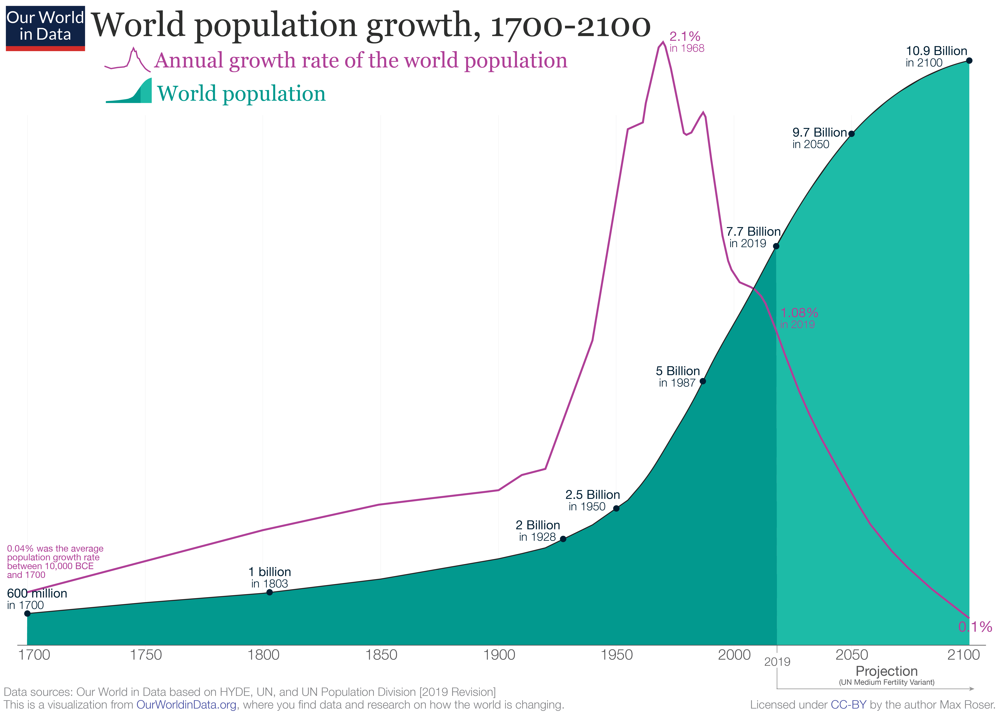

The following is a design of an envisioned city on Mars. It describes a pioneering large settlement in space - one that should be possible to build already in 21st century. Its design focuses on characteristics that will make it practical, vital and sustainable. As such, the design of this city will greatly differ from possible designs of future cities created after mankind has well established its presence in space.

```
Summary of the city design instead of design principles:
- economics of the city - three roles: governor providing infrastructure and service platform, service companies providing services and the residents/citizens
- three phases that fuel growth with unique attractiveness
- life support - with minimum set of services
- politics, culture, economy, ... - participates in the "global" (now interplanetary) system but will quickly build own style and add to diversity of human civilization. Large set of services. Good standard of living. It will become a great place to live in
```

The design of the city follows a roadmap of three key milestones and the interaction of three key participating groups:


 - The city is founded in 2030 with the infrastructure and staff to support scientists and tourists. The city will gradually attract more scientists and tourists and re-invest the income in scaling the infrastructure and staff, with 8:2 ratio of staff to scientists/tourists, until it reaches population of 1 thousand
 - The city will build its first space elevator in 2050. The elevator will be a wonder of the world on its own with great economic and social impact. It will mark a turning point for the city when it will offer more affordable way for certain people to maintain their desired standard of living on Mars than on the Earth. The number of people self-funding their migration to the city will for the first time exceed the number of residents hired to support the scientists and tourists
 - The city will build its first industry factory in space in 2100. The factory will have strong competitive advantages over the industries on the Earth in producing certain products by exploiting the vacuum of space, zero gravity, less risk of polution. The city will maintain average yearly growth of 4-5% to reach a population of 1 million until 2150

The city growth is driven by the interaction of three groups:

```
diagram of Governor, Service companies, Residents
```

 - Governor - the governor provides the infrastructure and a service platform for the services
 - Service companies - service companies provide paid services to city residents
 - Residents - the residents pay tax to the governor and consume the services from service companies

# Development and growth

A government or private entity will found the city. People will then move into the city to live and work in. Service companies will also move into the city to continue developing it.

The city will go through three phases with respect to its economy development:
1. Science and tourism - The short-term phase in which the population is between 10 and 1 thousand. The city will develop unique opportunities for scientists and tourists to support its growth
2. Real-estate - The mid-term phase in which the polulation grows from 1 thousand to 100 thousand. The city will develop unique niche of standard of living to attract people and support its growth
3. Industrial - The long-term phase in which the population will grow from 100 thousand to 1 million. The city will build the first industrial zone in space to support its growth through exports

## Science and tourism phase
Years: from 2030 to 2050
Population: from 10 to 1000
Growth: 20%
Attractiveness: paying scientists and tourists

The role of governor, citizens, service companies. The point of view of governor, citizens, service companies

Governor founds the city with initial investment. Investment costs projections. ROI

## Real-estate phase
Years: from 2050 to 2100
Population: from 1K to 100K
Population growth rate: 10%
Attractiveness: Unique niche for standard of living for cost of living

The role of governor, citizens, service companies. The point of view of governor, citizens, service companies

Why attractive to investors and loaners?


Why attractive to new citizens?
Certain people will find it cheaper to maintain their desired standard of life on Mars rather than on Earth because of over-population issues. They will be able to move in on a basic mortgage.
Cost projections for citizens.

Diagram:
 - Citizens pays Governor for housing. Governor gives regulation of services.
 - Service companies give services to citizens. Service companies receive subscription fees from citizens.
 - Service companies give tax to governor. Governor gives service platform and access to citizens.

The governer of the city will act as a platform for the service companies to serve people. The governor will maintain the infrastructure and regulate the service companies to make sure they can ensure their services and not risk lives.

Minimum set of services

## Industrial phase
Years: from 2100 to 2150
Population: from 100K to 1M
Population growth rate: 5%
Attractiveness: Prospering industrial zone

The role of governor, citizens, service companies. The point of view of governor, citizens, service companies

At this point the city will have advantage over the Earth in building a large industrial complex in space. This industrial complex will have unique possibilities for supporting special technologies and developing economies. For example, it will have easier access to asteroid-mined resources, will be able to use technologies relying on zero-gravity or vacuum, will be less exposed to risks of polution, etc.
The city will use its space elevator to build the complex at a lower cost for transportation and construction as compared to Earth competition. The complex will be robotized and controlled from Mars surface.

# Habitat and life support

This section describes the city design

Building blocks of infrastructure, private spaces and social spaces

- living space
- protection from radiation
- sunlight

# Minimum set of services

- air conditioning
- water
- heating
- food
- waste management

# 

# References

* https://www.researchgate.net/publication/222382174_Population_Growth_in_the_World's_Largest_Cities - assumption for growth of 10% in second phase and 5% in third phase
* https://ourworldindata.org/world-population-growth - 
